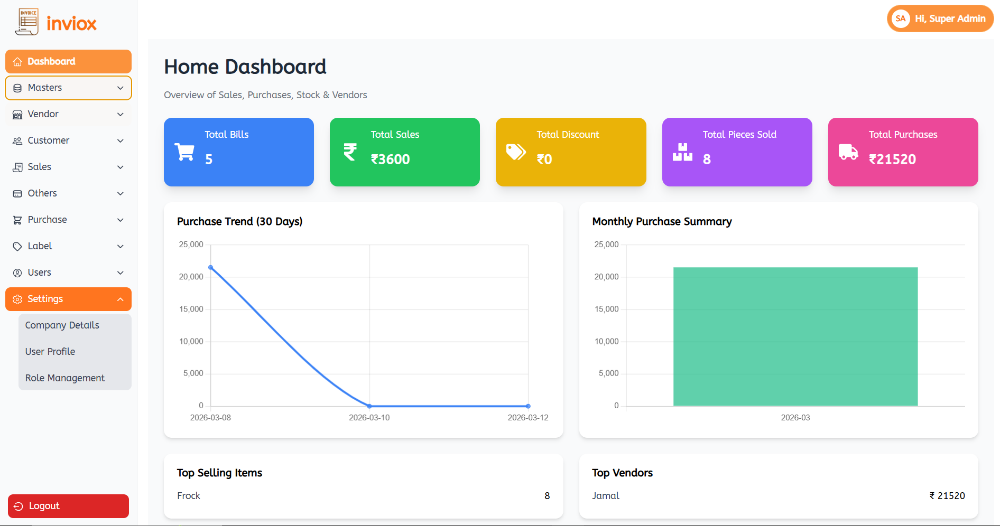

# 🧾 Inviox – Mini Retail Management System


**Inviox** is a **Mini Retail Management System** built as a desktop application using **Electron**.
It helps small retail businesses manage **products, inventory, and basic store operations** through a simple and user-friendly desktop interface.

The application uses **web technologies (HTML, CSS, JavaScript)** combined with Electron to deliver a **cross-platform desktop solution**.

---

# 📌 Features

✅ Product Management
✅ Retail Inventory Tracking
✅ Simple Desktop UI
✅ Fast & Lightweight
✅ Easy to Extend for Future Features
✅ Cross-platform Desktop Application

---

# 🧑‍💻 Tech Stack

| Technology   | Purpose                       |
| ------------ | ----------------------------- |
| **Electron** | Desktop application framework |
| **Node.js**  | Backend runtime               |
| HTML5        | UI structure                  |
| CSS3         | Styling                       |
| JavaScript   | Application logic             |

---

# 📂 Project Structure

```id="invioxp1"
Inviox
│
├── main.js          # Electron main process
├── renderer.js      # Renderer process logic
├── index.html       # Application UI
├── package.json     # Project configuration
└── README.md        # Documentation
```

---

# ⚙️ Installation

### 1️⃣ Clone the repository

```bash id="invioxp2"
git clone https://github.com/jam92444/Electron-App.git
cd Electron-App
```

### 2️⃣ Install dependencies

```bash id="invioxp3"
npm install
```

---

# ▶️ Running the Application

Start the application:

```bash id="invioxp4"
npm start
```

This will launch the **Inviox Desktop Application**.

---

# 🖥 Application Workflow

### 1️⃣ Main Process

The **Electron main process** initializes the app and creates the application window.

```javascript id="invioxp5"
const { app, BrowserWindow } = require('electron');

function createWindow() {
  const win = new BrowserWindow({
    width: 900,
    height: 600
  });

  win.loadFile('index.html');
}

app.whenReady().then(createWindow);
```

---

### 2️⃣ Renderer Process

The renderer process handles:

* UI interactions
* Retail management logic
* Data display

---

# 📸 Screenshots

*(Add screenshots here after running your app)*

Example:

```
/screenshots/dashboard.png
/screenshots/product-list.png
```

Then add:

```

```

---

# 🚀 Future Improvements

* 📦 Inventory tracking system
* 🧾 Invoice & billing system
* 👥 Customer management
* 📊 Sales analytics & reports
* 💾 Database integration (SQLite / MongoDB)
* 🖨 Receipt printing

---

# 🎯 Use Cases

Inviox is useful for:

* Small retail stores
* Mini supermarkets
* Local shop owners
* Student project demonstrations
* Learning **desktop app development**

---

# 🤝 Contributing

Contributions are welcome!

Steps:

1. Fork the repository
2. Create a feature branch
3. Commit your changes
4. Push and open a Pull Request

---

# 📄 License

This project is licensed under the **MIT License**.

---

# 👨‍💻 Author

Developed by **Your Name**

GitHub:
[https://github.com/jam92444](https://github.com/jam92444)

---

💡 **Pro tip:**
Add **3 screenshots** to your repo — recruiters love seeing UI.

Example:

* Dashboard
* Product management
* Billing page

---
